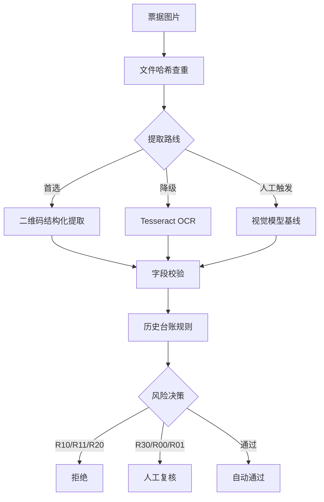

# 企业报销票据重复与异常风险审核 Agent


一个可评测、可追溯、有人机兜底的 AI PM 作品集原型：先可靠取得票据关键字段，再用确定性规则检查批次内重复、历史重复和近似异常。

> 展示的重点不是"让大模型自动审批"，而是 AI 产品经理如何设计一条有证据、能回归、失败关闭、有人接管的高风险工作流。

## 目录

- [业务背景](#业务背景)
- [用户场景](#用户场景)
- [人机方案](#人机方案)
- [工作流](#工作流)
- [评测与迭代](#评测与迭代)
- [评测证据](#评测证据)
- [数据与边界](#数据与边界)
- [本地运行](#本地运行)

## 业务背景

企业报销中，票据重复报销是财务审核的高频痛点：同一张发票在不同批次重复提交、PDF 与图片混报、金额相同但号码不同的近似票据。传统人工审核依赖财务人员肉眼比对，效率低且容易遗漏；而 OCR 直接提取字段准确率不稳定，大模型直接判断"是否重复"又存在幻觉和不可解释的问题。

本项目验证的核心问题：**在高风险财务场景中，如何组合二维码、OCR、视觉模型三条提取路线，用确定性规则做风险判断，并把所有不确定项交给人工？**

## 用户场景

- **目标用户**：企业财务审核人员
- **核心场景**：一批报销票据（图片/PDF）提交后，系统自动提取票号、日期、金额，查重并标记风险，财务人员只复核系统标记的异常项
- **边界**：不做税务验真、不做自动审批，未接入税务平台前自动放行率为 0%

## 人机方案

| 环节 | AI/系统负责 | 人负责 |
|------|------------|--------|
| 字段提取 | 二维码优先，OCR/视觉模型降级 | 三条路线都失败时人工录入 |
| 重复判断 | 确定性规则（哈希/票号/近似匹配） | — |
| 风险决策 | 自动通过 / 人工复核 / 拒绝三级分流 | **所有真实风险决策必须人工确认** |
| 异常处理 | 字段冲突、权威状态缺失自动转人工 | 最终审批 |

关键设计：由于未接入税务平台验真，**真实风险决策自动放行率固定为 0%**，所有结论都附规则和证据并交给人工复核。

## 工作流



### 风险规则

| 规则 | 含义 | 动作 |
|------|------|------|
| R10 | 同一批次文件哈希相同 | 拒绝 |
| R11 | 同一批次发票号码相同 | 拒绝 |
| R20 | 与历史台账发票号码相同 | 拒绝 |
| R30 | 销售方+金额相同且日期相差≤3天但号码不同 | 标记疑似，人工复核 |
| R00/R01 | 日期/金额/票号异常或缺失 | 人工复核 |

### 架构选型

采用 **固定 Workflow + 模型局部决策 + 确定性规则 + Human in the Loop**，不使用多 Agent 动态编排。原因：报销审核步骤固定、输出格式明确，财务场景要求可复现、可解释和可审计。

## 评测与迭代

### 字段提取路线对比（5张真实票据）

| 提取路线 | 票号 | 日期 | 金额 | 结论 |
|----------|------|------|------|------|
| 本地二维码解析 | 5/5 | 5/5 | 5/5 | **首选路径** |
| Tesseract 本地 OCR | 4/5 | 2/5 | 5/5 | 仅作降级 |
| 豆包客户端视觉 | 2/5 | 5/5 | 5/5 | 人工触发基线，非 API 集成 |

5 张测试图片中有 1 组完全重复图片，共 4 张不同票据。

### 规则回归

- 36 条合成数据规则回归：36/36 通过
- 注意：这是合成结构化数据的规则回归，**不是线上拦截率**

### 失败案例与修正

二维码审计过程中发现并修正了原人工黄金集中的两条漏位票号——即人工标注本身也会出错，修正前标签已在私有目录备份。这验证了"可追溯"的价值：不仅审票据，也审评测集本身。

### OCR 短板公开

Tesseract 日期提取只有 2/5，没有把这个数字"修成正确"。日期字段的 OCR 识别率低是真实局限，后续可通过二维码优先策略规避，或引入更强的 OCR 模型。

## 评测证据

| 文件 | 内容 |
|------|------|
| `eval/field_extraction_comparison.md` | 三条字段提取路线对比 |
| `eval/end_to_end_demo_report.md` | 5张图片到风险结论的端到端证据 |
| `eval/gold_label_audit.json` | 不含真实票号的标签修正记录 |
| `eval/qr_baseline_results.json` | 二维码公开评测 |
| `eval/ocr_baseline_results.json` | OCR 基线评测 |
| `eval/results_v1.json` | 36条合成规则回归 |
| `docs/AI_PRD_补充版.md` | 完整产品方案、节点契约、异常处理 |
| `docs/capability-audit.md` | 原始 Workflow 问题及修正 |

## 数据与边界

- 原始票据、二维码原文、真实字段和逐条客户端结果只保存在本地私有目录
- 公开数据是脱敏或合成数据
- 二维码解析成功只证明字段被读取，**不证明发票真实有效**
- 项目尚未接入税务平台验真、红冲或作废状态查询
- 没有生产级权限、审计日志和人工复核界面
- 因此真实风险决策自动放行率仍设为 0%

### 后续规划

- 接入税务平台验真、红冲和作废状态查询
- 开发持久化人工复核队列和审核界面
- 增加节点级运行日志、P50/P95 时延和失败率看板
- OCR/视觉模型自动降级编排
- 企业身份、权限、数据加密和审计合规
- 脱敏历史数据试点和 R30 阈值校准

## 本地运行

```powershell
python -m pip install -r requirements.txt
python src/audit.py --self-test
python eval/evaluate.py
python src/audit.py --incoming data/incoming_invoices.json --ledger data/historical_ledger.json --output examples/audit_results.json
```

运行效果：

```text
$ python src/audit.py --incoming data/incoming_invoices.json --ledger data/historical_ledger.json
{"total": 5, "high_risk": 3, "manual_review": 4, "auto_pass": 1}

IN-001 | high    | confirmed_duplicate | R10,R11 | same file hash appears 2 times; same invoice ID appears 2 times
IN-002 | high    | confirmed_duplicate | R10,R11 | same file hash appears 2 times; same invoice ID appears 2 times
IN-003 | high    | confirmed_duplicate | R20     | matches historical record H-001
IN-004 | review  | needs_review        | R30     | same seller+amount within 3 days, different invoice number
IN-005 | pass    | no_risk             | —       | no duplicate or anomaly detected
```

真实图片端到端演示需要本地私有图片和标签，公开包不提供原图。

## License

MIT
